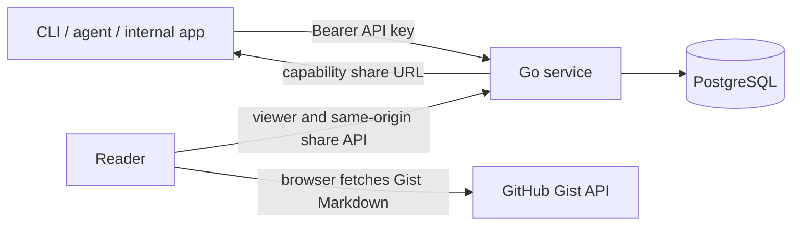
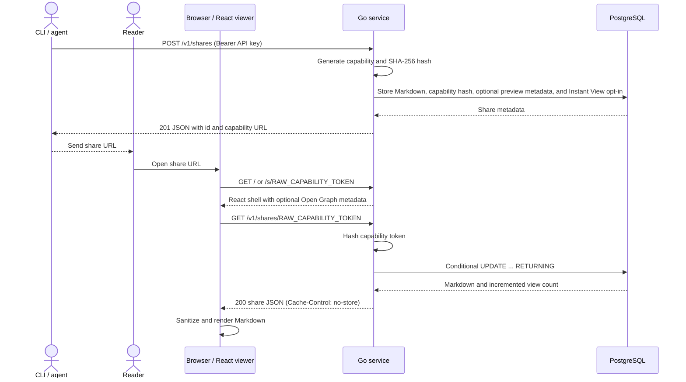

# Design and security

Morsel exposes the API and React viewer from one Go service on one domain. PostgreSQL is the only content store.

## How it works

The service handles `/`, `/s/*`, `/gist/`, `/assets/*`, `/v1/*`, `/healthz`, and `/readyz` on one domain. Preview-enabled `/s/<token>` responses inject Open Graph metadata into the otherwise static viewer shell. Instant View shares additionally inject server-rendered GFM into the viewer root; the React viewer replaces it after loading in a browser. JavaScript and CSS remain static assets. Morsel v1 has no Redis, object storage, queue, account system, separate static host, or Node.js runtime server.

## View and availability semantics

- Every successful `GET /v1/shares/<token>` consumes exactly one view, including browser refreshes, command-line requests, and bots that call the API.
- Fetching an enabled `/s/<token>` Open Graph preview does not consume a view. Link-preview crawlers do not execute the viewer JavaScript, while a browser does and therefore consumes a view through the API.
- An Instant View share exposes the complete rendered article through the same non-consuming request. It cannot use expiration or view limits, and revocation cannot remove copies already cached by Telegram.
- Preview metadata can be fetched repeatedly by anyone holding its capability URL. Disable preview when its explicit title, description, image URL, or locale must not be exposed this way.
- Morsel does not identify people or deduplicate clients. `max_views` counts successful retrievals, not unique readers.
- A conditional PostgreSQL `UPDATE ... RETURNING` protects the final view, so concurrent requests cannot exceed the configured limit.
- Retrieval responses use `Cache-Control: no-store`; proxies must not cache them.
- Unknown capabilities return `404`. Expired, revoked, and exhausted capabilities return `410` with distinct codes. This improves viewer messages but reveals the capability's state to anyone who already possesses it.
- A lost raw capability cannot be recovered. Revoke the share and create a replacement.

## Security model

- Capability tokens contain 256 random bits, are base64url encoded, and are never stored raw.
- Preview is disabled when its metadata object is omitted. Hash-route URLs keep the capability out of the initial document request; preview metadata intentionally places it in `/s/<token>` so link crawlers can request the explicit title, description, optional image and locale, and canonical share URL.
- Telegram Instant View is separately disabled by default. Enabling it exposes sanitized rendered Markdown in the initial HTML and permits Telegram to retain a cached copy outside Morsel's revocation controls.
- Administrative API keys are hashed before constant-time comparison.
- Request logs use route templates instead of token-bearing paths and omit bodies and authorization headers.
- Authored HTML is disabled. Markdown from both Morsel shares and GitHub Gists passes through the same reviewed sanitation schema; KaTeX output is sanitized as well.
- Gist IDs are validated before the browser makes an unauthenticated request to the CSP-allowlisted `api.github.com` origin.
- KaTeX trust is disabled. Mermaid renders sequentially with strict security, source and count limits, and DOMPurify SVG sanitation.
- Vega-Lite uses interpreted expressions, inline-only resources, rejected expansive generators and transforms, disabled embed options and tooltips, and source and count limits.
- External links use `noopener noreferrer`; images use `Referrer-Policy: no-referrer` and lazy loading.
- Production serves the API and viewer from one HTTPS origin and does not enable browser CORS.

Morsel cannot protect a share after its capability URL is disclosed. Revoke exposed shares and rotate exposed administrative keys.
